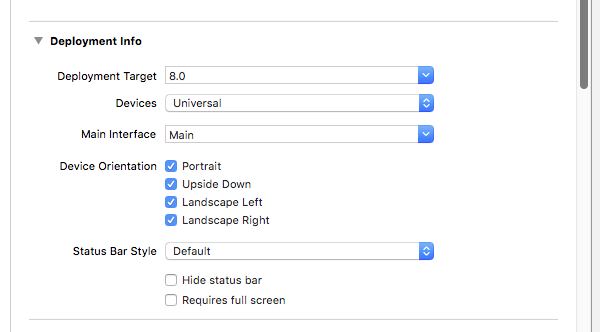

# Publish Device Orientation

This example demonstrates sending orientation metadata to subscribers of a broadcast when the Publisher rotates their physical device.

### Example Code

- ***[BaseTest.swift](../BaseTest.swift)***
- ***[PublishDeviceOrientationTest.swift](PublishDeviceOrientationTest.swift)***

## Running the example

After starting a broadcast, rotate your device from portrait to landscape. You will notice that the view updates on the broadcasting device. Additionally, if you subscribe with mobile or the browser-based players, you will see their orientation update with the change to device orientation.

## Implementation as Publisher

### Device Orientation project settings

All the `Device Orientation` options have been turned on for the project in order to demonstrate this example.



This will allow the view displaying the camera playback to update based on device orientation.

### UIDeviceOrientationChange

When the `PublishDeviceOrientationTest` is selected and shown, a `UIDeviceOrientationChange` notification listener is assigned:

```Swift
NotificationCenter.default.addObserver(self, selector: #selector(PublishDeviceOrientationTest.rotated), name: NSNotification.Name.UIDeviceOrientationDidChange, object: nil)
```

[PublishDeviceOrientationTest.swift #41](PublishDeviceOrientationTest.swift#L41)

When the handler (`PublishDeviceOrientationTest.rotated`) is invoked, the current orientation is determined using `UIApplication.shared.statusBarOrientation`. Depending on the orientation value of the device, the `orientation` value of the `R5Camera` instance currently being used is updated.

```Swift
let cam = self.publishStream?.getVideoSource() as! R5Camera
let orientation = UIApplication.shared.statusBarOrientation;

switch (orientation) {
  case UIInterfaceOrientation.portrait:
    cam.orientation = 90;
  case UIInterfaceOrientation.portraitUpsideDown:
    cam.orientation = 270;
  case UIInterfaceOrientation.landscapeLeft:
    cam.orientation = 0;
  case UIInterfaceOrientation.landscapeRight:
    cam.orientation = 180;
  default:
    cam.orientation = 90;
}
```

[PublishDeviceOrientationTest.swift #54](PublishDeviceOrientationTest.swift#L54)

The updated `orientation` value will be sent along in the MetaData provided to all subscribers which will need to respond appropriately.

## Implementation as Subscriber
When MetaData is received on the Subscriber, there is an `orientation` property values that relates to the current orientation of the Publisher stream.

For the iOS Subscriber example, the `orientation` MetaData is parsed and applied as a rotation `transform` on the `R5VideoViewController` instance that is displaying the incoming stream:

```Swift
func updateOrientation(value: Int) {

  if current_rotation == value {
    return
  }

  current_rotation = value
  currentView?.view.layer.transform = CATransform3DMakeRotation(CGFloat(value), 0.0, 0.0, 0.0);

}

func onMetaData(data : String) {

  let props = data.characters.split(separator: ";").map(String.init)
  props.forEach { (value: String) in
    let kv = value.characters.split(separator: "=").map(String.init)
    if (kv[0] == "orientation") {
      updateOrientation(value: Int(kv[1])!)
    }
  }

}
```

[SubscriberTest.swift #45](../Subscribe/SubscriberTest.swift#L45)

